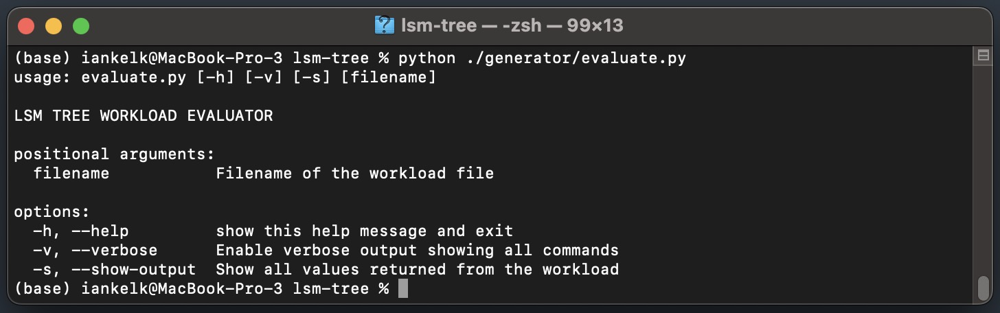
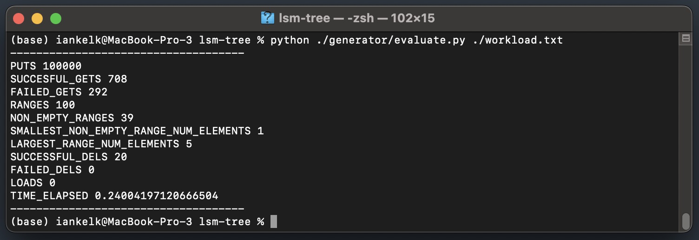

# Workload generator and evaluate.py bug fixes and improvements#
---
*This repository contains fixes for the code of a workload generator and workload evaluator for an LSM tree.*

*More information can be found [here](http://daslab.seas.harvard.edu/classes/cs265/project.html).*

## Workload and Data Generator ##
---

### generator.c ###

#### Issues: ####

The generator.c from the repo has several problems:

1. The `--seed` argument doesn't work, which means the workloads generated are identical. This is a problem if you need different workloads for testing concurrent clients.

2. It front-loads everything. If you do 1,000,000 PUTs and 100 GETs, those 100 GETs will be mixed in with the first 100 PUTs, and then ... nothing but 9,999,800 PUTs after that.

3. The gets-misses-ratio option is always off by 10%. The default behavior was supposed to be 0.5, but it actually defaults to 0.6 misses to 0.4 gets. You can confirm this with the updated version of `evaluate.py`

4. The RANGE generation is very problematic. It generates 2 keys within the entire space of `KEY_MAX 2147483647` to `KEY_MIN -2147483647`. As a result, in a database with a billion entries, the RANGE queries would start returning ridiculously large ranges that could theoretically reach a billion entries (in practice it was still in the millions). Even when I ran 1 million PUTs and 100 RANGEs and then shuffled it to avoid the front-loading mentioned in problem 2 above, it would return a total of almost 18 million entries since each of the 100 ranges was MASSIVE.

#### Fixes: ####

1. `--seed` has been fixed and now generates different workloads based on the seed.

2. The code now calculates the remaining operations for each type and then calculates the percentage relative to the total remaining number of commands for each operation. Now, the PUT, GET, DELETE, and RANGE operations are not clustered around the beginning and are evenly distributed throughout the workload.

3. I've corrected the error that was putting it off by 10% by performing integer division on the random number with RAND_MAX instead of taking modulo 10. This fixed the issue. Specifically: 

```c
// This
if((rand()%10) > (s->gets_skewness*10) || old_gets_pool_count == 0) {
// Was changed to this:
if((((float)rand()) / RAND_MAX > s->gets_skewness) || old_gets_pool_count == 0) {
```

4. To fix the creation of huge ranges, I've introduced another argument `--max-range-size`. Now you can set `--max-range-size` as one of the arguments. This will take whatever value you have, get a random number using a uniform distribution for it between its negative and positive values, and add it to the beginning of the range. For example, if you set `max-range-size` to be `1000` and the start key picked was `1674510637`, it will uniformly pick a range size from `-1000` to `1000` and add it to `1674510637`. It might pick 313 and print the range `r 1674510637 1674510950`. This allows you to test RANGE queries without having your database brought to a crawl by it repeatedly trying to return ranges of millions of key-value pairs. It also ensures that the ranges do not go beyond the bounds of `KEY_MIN` and `KEY_MAX`.

## Here is a screenshot of the modified help screen which includes the `--max-range-size` option.


### Example ###
**Query:** Insert 100000 keys, perform 1000 gets and 10 range queries (with a maximum range size of 1000 elements) and 20 deletes. The amount of misses of gets should be approximately 30% (--gets-misses-ratio) and 20% of the queries should be repeated (--gets-skewness).

```
./generator --puts 100000 --gets 1000 --ranges 10 --deletes 20 --gets-misses-ratio 0.3 --gets-skewness 0.2 --max-range-size 1000 > workload.txt
```

### evaluate.py ###

## Evaluating a Workload ##
---
You can execute a workload and see some basic statistics about it, using the `evaluate.py` python script.

### Dependencies ###
You need to install the [sortedcontainers](https://pypi.org/project/sortedcontainers/) library.

Most platforms: ```pip install sortedcontainers```

*Note: In Fedora Linux, you might need to install it using: ```dnf install python-sortedcontainers```.*

*Note: In previous versions, `evaluate.py` used a library called `blist`, however that library has not been maintained since 2014 and is not compatible with Python 3.*

#### Issues: ####

1. The `blist` library hasn't been updated since 2014 and is not compatible with modern python. As well, all the print statements are written in Python 2.

2. Inside the main() function, there are two flags, `verbose` and `show_output` which are hardcoded and not explained.

#### Fixes: ####

1. I've corrected these problems. I've replaced the `blist` library with the `sortedcontainers` library, which is an actively maintained alternative providing sorted list and sorted dictionary data structures. You can install it using:

`pip install sortedcontainers`

2. The two flags, `verbose` and `show_output` have been changed to command-line arguments. To do this, `import argparse` was added to the top of the file, but it does not require any additional libraries to be installed.

### Running ###

Run as follows:
```
python evaluate.py workload.txt
```

### Help screenshot


### Example of results of evaluating workload

