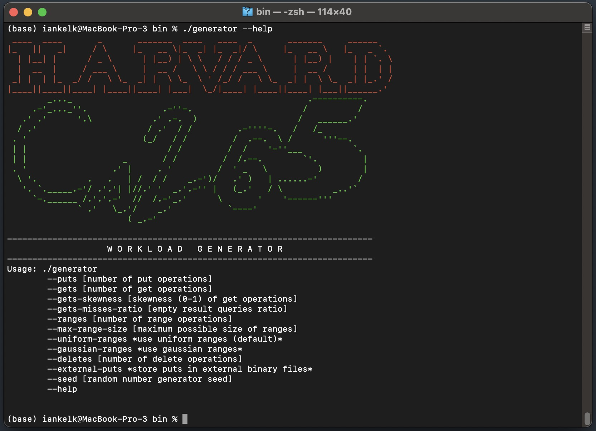
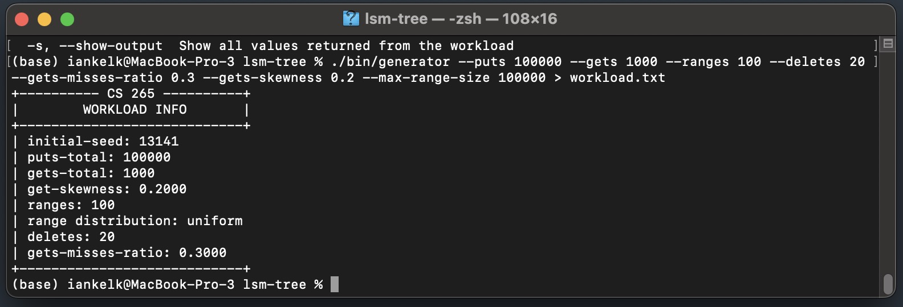
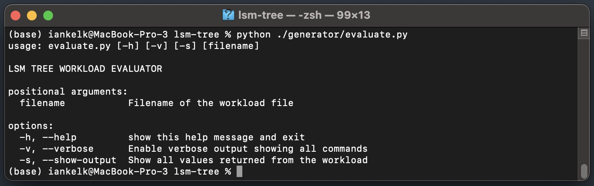
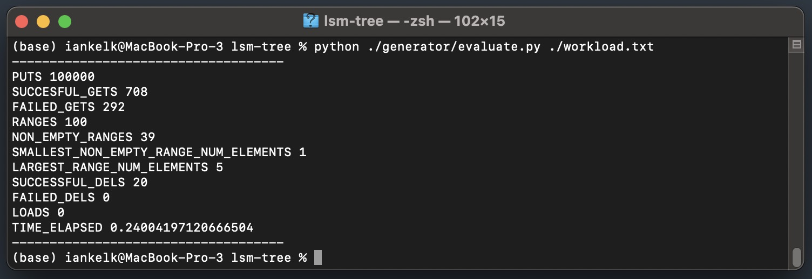

# Workload generator and evaluate.py bug fixes and improvements#
---
*This repository contains fixes for the code of a workload generator and workload evaluator for an LSM tree.*

*More information can be found [here](http://daslab.seas.harvard.edu/classes/cs265/project.html).*

## Workload and Data Generator ##
---

### Dependencies ###
You need the GNU scientific library in order to use the generator (https://www.gnu.org/software/gsl/).

* Ubuntu Linux: ```sudo apt-get install libgsl-dev```
* Fedora Linux: ```dnf install gsl-devel```
* Mac OS X: ```brew install gsl```
* Cygwin: install the *gsl, gsl-devel* packages

### Building ###
```
cd generator;
make clean; make;
```

or simply...
```
cc generator.c -o generator -lgsl -lgslcblas
```

### Running ###
You can now run the following to see all available options:
```
./generator --help
```

### Help screenshot


For ranges, the `max-range-size` is useful so that your ranges don't become massive as the number of keys in the database grows. For example, if you don't use `max-range-size` and you insert 1 billion keys into the database, it is possible that some ranges could return hundreds of millions of key value pairs. Conversely, if there aren't enough entries in the database, a `max-range-size` that is too small will return mostly empty ranges. It's best to only begin using it once you're working with databases with a significant number of entries. This will become evident as your database grows and the size of the returned ranges begin exceeding thousands of entries.

### Examples ###
**Query 1:** Insert 100000 keys, perform 1000 gets and 10 range queries (with a maximum range size of `100000` entries) and 20 deletes. The amount of misses of gets should be approximately 30% (`--gets-misses-ratio`) and 20% of the queries should be repeated (`--gets-skewness`).

```
./generator --puts 100000 --gets 1000 --ranges 10 --deletes 20 --gets-misses-ratio 0.3 --gets-skewness 0.2 --max-range-size 100000 > workload.txt
```

### Example of results of evaluating workload


**Query 2:** Same as above but store the data in external (.dat) binary files.
```
./generator --puts 100000 --gets 1000 --ranges 10 --deletes 20 --gets-misses-ratio 0.3 --gets-skewness 0.2 --external-puts > workload.txt
```

**Query 3:** Perform 100000 puts and issue 100 range queries (drawn from a gaussian distribution).
```
./generator --puts 100000 --ranges 100 --gaussian-ranges > workload.txt
```

**Query 4:** Perform 100000 puts and issue 100 range queries (drawn from a uniform distribution).
```
./generator --puts 100000 --ranges 100 --uniform-ranges > workload.txt
```

**Note: You can always set the random number generator seed using --seed XXXX**


## Evaluating a Workload ##
---
You can execute a workload and see some basic statistics about it, using the ```evaluate.py``` python script.

### Dependencies ###
You need to install the [sortedcontainers](https://pypi.org/project/sortedcontainers/) library.

Most platforms: ```pip install sortedcontainers```

*Note: In Fedora Linux, you might need to install it using: ```dnf install python-sortedcontainers```.*

*Note: In previous versions, `evaluate.py` used a library called `blist`, however that library has not been maintained since 2014 and is not compatible with Python 3.*

### Running ###

Run as follows:
```
python evaluate.py [-h] [-v] [-s] [workload.txt]
```

### Help screenshot


### Example of results of evaluating workload generated above
